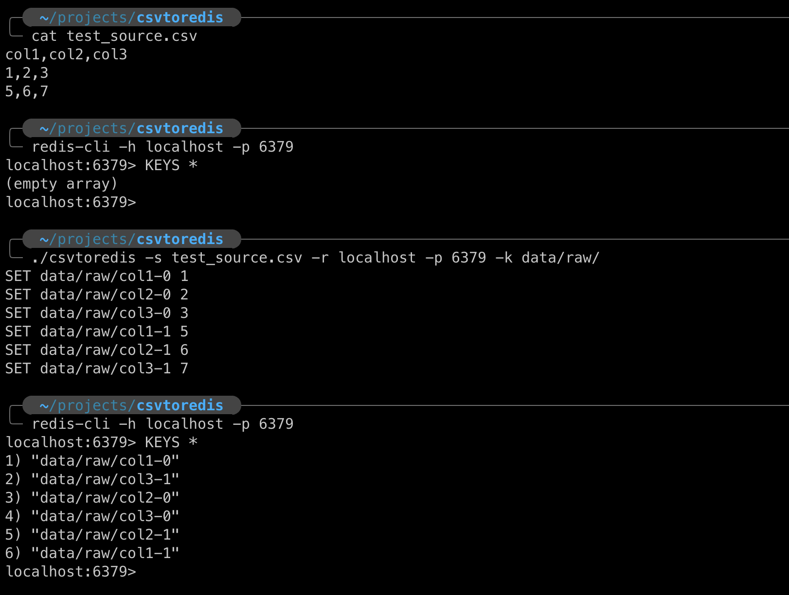

## CSV to Redis

```
Upload a CSV file to Redis. The tool will create a key for each column and row.
The key name will be in the format <prefix><column_name>-<row_number>.

Usage:
  csvtoredis [flags]

Flags:
      --config string             config file (default is $HOME/.csvtoredis.yaml)
  -s, --csv string                CSV file to read from
  -h, --help                      help for csvtoredis
      --just-text                 Plain text output
  -r, --redis-host string         Redis host (default "localhost")
  -k, --redis-key-prefix string   Redis key prefix
  -w, --redis-password string     Redis password
  -p, --redis-port string         Redis port (default "6379")
```

### Example

This will read the `test_source.csv` file of the following contents:

```
col1,col2,col3
1,2,3
5,6,7
```

And translate it into Redis entries

`./csvtoredis -s test_source.csv -r localhost -p 6379 -k data/raw/`



## Pre-built binaries

Binaries for Windows, Mac and Linux are available in the Releases section. 

## Build

If on the other hand, you prefer to build the app yourself, the process is quite simple:

- install Go

Installation steps specific to your OS can be found in the official docs [here](https://go.dev/doc/install)

On a Mac:

```bash
brew install go
```

- build the package

```bash
go build
```

- Build for Windows

This assumes you're on a Mac or Linux

```bash
GOOS=windows GOARCH=amd64 go build
```

If you're on a Windows machine, you could just run `go build`
